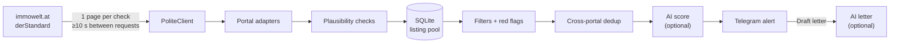

<p align="center">
  
</p>

<h1 align="center">wohnkompass-oss</h1>

<p align="center">
  <b>Your own Telegram alert for new flats in Austria, with polite scraping, tests and one config file.</b><br>
  The open-source, single-user edition of <a href="https://t.me/wohnkompass_bot">WohnKompass</a>.
</p>

<p align="center">
  <a href="https://github.com/SwitchmanPlay/wohnkompass-oss/actions/workflows/ci.yml"></a>
  
  <a href="LICENSE"></a>
  
</p>

<p align="center">
  <a href="#quickstart">Quickstart</a> ·
  <a href="#how-it-works">How it works</a> ·
  <a href="#polite-by-default">Polite by default</a> ·
  <a href="#limits">Limits</a> ·
  <a href="https://t.me/wohnkompass_bot">Try the full bot</a>
</p>

---

In Vienna a good flat can be gone a few hours after it is listed. **wohnkompass-oss**
checks **immowelt.at** and **immobilien.derstandard.at** for you, applies your filters,
flags the local catches (fixed-term lease, *Ablöse*, commission, *Wohn-Ticket*) and sends
each new match to your Telegram, optionally with an AI fit score and a one-tap
application letter.

```text
🏠 New · Bright 2-room flat near U3, fixed-term 3 years
immowelt · also on derStandard
💶 ≈ €1,084 (net €890) · 54 m² · 2 rooms · 1070 Neubau, Wien
⚠️ fixed-term lease
🤖 8/10 · Good price for Neubau; short lease is the catch.
      [ Open listing ]  [ ✍️ Draft letter ]
```

> [!NOTE]
> **This is a simplified version of [WohnKompass](https://t.me/wohnkompass_bot)**, a
> multi-user bot I run as a product. This repository shows how it works and lets a
> technical person run a small version for their own flat search. The full product is
> described in the [WohnKompass showcase](https://github.com/SwitchmanPlay/wohnkompass-showcase).

## What's in this edition

| | wohnkompass-oss (this repo) | [WohnKompass](https://t.me/wohnkompass_bot) |
|---|---|---|
| Users | you (one chat) | many, with a guided search wizard |
| Portals | immowelt, derStandard | five portals, incl. detail pages |
| Filters | budget, size, rooms, postcodes, red flags | same, plus more cities and deal types |
| Duplicates across portals | ✅ merged into one alert | ✅ |
| Price-drop alerts | ✅ | ✅ |
| AI fit score | optional, one model you configure | model chains across providers, calibrated prompts |
| Photo scoring | optional (vision model) | ✅ |
| Application letters | optional, one tap | ✅ answers what the ad asks |
| Languages | English, German | seven, incl. right-to-left |
| Hosting | you run it | hosted, nothing to install |

## Features

- **Two portals, one feed.** Newest-first search pages on immowelt.at and derStandard
  Immobilien. The same flat posted on both arrives once, marked *also on …*.
- **Filters that respect local reality.** immowelt quotes *net* rent; the bot estimates
  the warm rent (net + €3.60/m²) before comparing it with your budget and shows it as `≈`.
- **Red flags without AI.** Fixed-term leases (*befristet*), key money (*Ablöse*), agent
  commission (*Provision*) and council flats that need a *Wohn-Ticket*. Show them, or
  drop such listings entirely.
- **Price drops.** Every listing seen is remembered for 30 days, so a flat that was too
  expensive yesterday can alert you today.
- **Optional AI** through any OpenAI-compatible endpoint (OpenRouter, OpenAI, a local
  Ollama or LM Studio): a 1–10 score with a one-line reason, optional photo scoring, and
  a **Draft letter** button that writes an application from your short profile.
- **No flood on day one.** The first check only learns what is already online; from then
  on you get new listings only.
- **Honest failure.** A blocked portal is paused and you are told; a portal that suddenly
  returns nothing ("the layout changed") triggers a warning instead of silence.

## How it works



Each check fetches **one results page per portal** (newest first), parses it with a
pure, offline-tested adapter, drops listings that cannot be real (wrong postcode,
impossible €/m²), and stores everything in a small SQLite pool. Only listings that are
new or dropped in price, match your filters and were not already sent from the other
portal reach the optional AI step and then your chat.

<details>
<summary><b>Project layout</b></summary>

```text
src/wohnkompass_oss/
  adapters/       immowelt.py, derstandard.py, base.py (shared parsers, JSON-LD fallback)
  config.py       search.toml + .env → validated, frozen settings
  http.py         PoliteClient: pacing, block detection, one retry
  plausibility.py reject data that cannot be real
  filters.py      rule filters and red flags
  dedup.py        same flat on two portals
  store.py        SQLite pool + per-portal pause state
  ai.py           scoring and letters, strict output validation
  render.py       Telegram HTML (en/de), always escaped
  pipeline.py     one check, independent of Telegram
  bot.py          commands, buttons, schedule
  cli.py          run | once [--dry-run] | check-config
tests/            offline tests with hand-written fixture pages
```

</details>

## Quickstart

You need Python 3.11+ (or Docker) and a Telegram account.

**1. Create a bot.** Message [@BotFather](https://t.me/BotFather), send `/newbot` and
copy the token. Then send any message to your new bot and get your numeric chat id,
for example from [@userinfobot](https://t.me/userinfobot).

**2. Install.**

```bash
git clone https://github.com/SwitchmanPlay/wohnkompass-oss.git
cd wohnkompass-oss
python -m venv .venv && source .venv/bin/activate   # Windows: .venv\Scripts\activate
pip install .
```

**3. Configure.**

```bash
cp .env.example .env                  # put TELEGRAM_BOT_TOKEN and TELEGRAM_CHAT_ID here
cp search.example.toml search.toml    # your city, budget, size, rooms, postcodes
wohnkompass-oss check-config
```

**4. See what matches right now** without Telegram and without touching the database:

```bash
wohnkompass-oss once --dry-run
```

**5. Run it.**

```bash
wohnkompass-oss run
```

The bot checks every ~20 minutes (±20 % jitter). Send it `/status` any time.

### Docker

```bash
mkdir data && cp search.example.toml data/search.toml   # then edit it
docker build -t wohnkompass-oss .
docker run -d --name wohnkompass --restart unless-stopped \
  --env-file .env -v "$PWD/data:/data" wohnkompass-oss
```

The SQLite database is written next to `search.toml` in `./data`.

### Bot commands

| Command | What it does |
|---|---|
| `/start` | what is being watched |
| `/status` | last check per portal, pauses, listings remembered |
| `/check` | check now instead of waiting |
| `/pause` · `/resume` | stop or restart the schedule |

Only the chat in `TELEGRAM_CHAT_ID` gets an answer; everyone else is ignored.

## Configuration

**`search.toml`** holds the search (see [`search.example.toml`](search.example.toml)).
Unknown keys and invalid values stop the program at startup with the name of the key.

| Key | Default | Meaning |
|---|---|---|
| `language` | `"en"` | `en` or `de`, for alerts and letters |
| `poll_minutes` | `20` | minutes between checks; **minimum 15** |
| `portals` | both | `immowelt`, `derstandard` |
| `database` | `wohnkompass.sqlite3` | relative to `search.toml` |
| `search.city` | required | `wien`, `graz`, `linz`, `salzburg` |
| `search.deal` | `"rent"` | `rent` or `buy` |
| `search.types` | `["flat"]` | `flat`, `house` |
| `search.postcodes` | `[]` | e.g. `["1070", "1080"]`; empty = whole city |
| `search.price_min` / `price_max` | none | warm rent (estimated if net) or purchase price, in € |
| `search.size_min` / `rooms_min` | none | minimum m² / rooms |
| `search.exclude_red_flags` | `[]` | drop listings with `befristet`, `abloese`, `provision`, `wohnticket` |
| `ai.enabled` | `false` | score listings and enable letters |
| `ai.min_score` | `6` | listings scored below this are not sent |
| `ai.photos` | `false` | send up to 3 photos with the scoring request |
| `profile.name` / `about` / `move_in` | empty | used only for application letters |

**`.env`** holds secrets (see [`.env.example`](.env.example)): `TELEGRAM_BOT_TOKEN`,
`TELEGRAM_CHAT_ID`, and optionally `AI_BASE_URL`, `AI_API_KEY`, `AI_MODEL`,
`HTTP_PROXY_URL`, `USER_AGENT`, `SEARCH_CONFIG`.

## Polite by default

The portals give this data to people for free, so the tool asks for as little as it can:

| Rule | Value |
|---|---|
| Requests per check | **one results page per portal** (two if you watch flats *and* houses) |
| Time between checks | **≥ 15 min**, default 20, with random jitter |
| Time between requests to one site | **≥ 10 s** plus up to 5 s jitter |
| On HTTP 403 / 429, a captcha or a bot-check page | **stop**: pause that portal 30 min, doubling up to 24 h (longer if `Retry-After` says so); the pause survives restarts and you get a message |
| Server errors, timeouts | one retry after 30 s, then wait for the next check |
| Detail pages, photos | never fetched by the tool (with `ai.photos` on, your AI provider loads up to 3 photo URLs) |

What it deliberately does **not** do: solve captchas, rotate identities or proxies to
get past a block, or impersonate a browser's network fingerprint. When a portal says no,
the tool listens.

About the User-Agent: both portals reject requests that identify as a script, even at
this low rate, so the tool sends a standard desktop-browser User-Agent. You can set your
own with `USER_AGENT`. The optional `HTTP_PROXY_URL` routes all requests through one
proxy of your choice; blocks are still respected.

## Limits

- **Two portals.** willhaben.at is not supported: its `robots.txt` forbids automated
  access. See [adding a portal](docs/adding-a-portal.md) for others.
- **Four cities**: Wien, Graz, Linz, Salzburg.
- **Page 1 only.** If more listings than fit on one page appear between two checks,
  the extra ones are missed. Price drops are noticed while a listing is still on page 1.
- **Parsers break when portals redesign.** A JSON-LD fallback softens this, and the bot
  warns you after three empty checks, but a redesign may need a code update.
- **derStandard new-build projects** (one card with several units) are skipped.
- **immowelt shows net rent** on its result cards; the warm rent is an estimate.
- **Duplicate detection is heuristic**: two similar units in the same new building can
  be merged.
- **One user.** The bot answers one chat. For many users, a hosted setup and more portals,
  there is [WohnKompass](https://t.me/wohnkompass_bot).

## Development

```bash
pip install -e ".[dev]"
pytest              # 200+ tests, fully offline
ruff check . && ruff format --check .
```

Tests use hand-written fixture pages that mirror the portals' markup with invented
data, a fake clock for the pacing rules, and mocked HTTP for the AI client. CI runs
lint, the test suite on Python 3.11–3.13, a Docker build and a secret scan on every push.

## Disclaimer

This project is not affiliated with immowelt, derStandard or any other portal. Listings,
texts and photos belong to the portals and their advertisers. Use the tool for your
own, **personal and non-commercial** flat search, read each portal's terms of use and
`robots.txt`, and keep the polite defaults. derStandard, for example, reserves commercial
text and data mining. The software is provided as is, without warranty (see the license).

## License

[MIT](LICENSE) © Danylo Prokhorenko

---

<sub>Built in Vienna by <a href="https://github.com/SwitchmanPlay">Danylo Prokhorenko</a> ·
<a href="https://portfolio.freshdesign.at">portfolio</a> ·
the full product: <a href="https://t.me/wohnkompass_bot">@wohnkompass_bot</a></sub>
